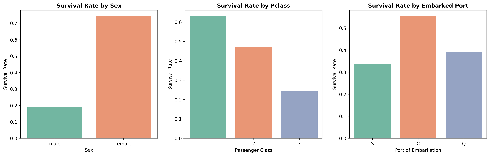
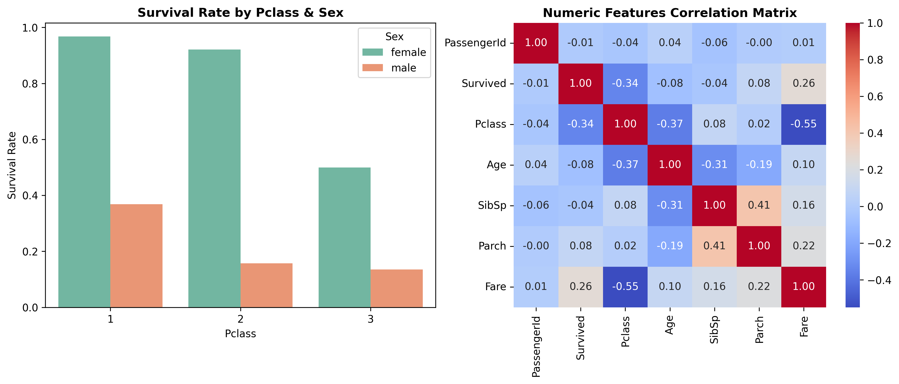
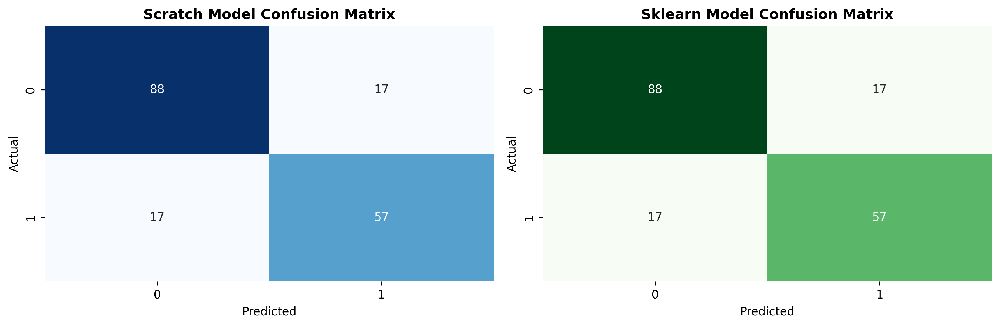

# 🚢 Titanic Survival Prediction: Scratch vs. Sklearn Logistic Regression

A Machine Learning project comparing a **from-scratch Logistic Regression implementation** (using NumPy and Vectorized Gradient Descent) against **Scikit-Learn's baseline model** on the Titanic dataset.

---

## 📊 Exploratory Data Analysis & Features

### 1. Categorical Survival Patterns

* **Key Finding:** Females had a significantly higher survival rate across all classes, while passengers in Class 3 suffered the highest mortality.

### 2. Feature Interactions & Correlations

* **Key Finding:** Strong correlation between ticket class (`Pclass`), fare, and overall survival probability.

---

## 🛠️ Feature Engineering & Preprocessing
* **Grouped Median Imputation:** Imputed missing `Age` values based on passenger titles (`Mr`, `Mrs`, `Miss`, `Master`, etc.) rather than a generic global median.
* **Title Extraction:** Extracted titles from names and consolidated rare titles into a `Rare` group to reduce noise.
* **Family Size Feature:** Engineered `FamilySize` (`SibSp` + `Parch` + 1).
* **Feature Scaling:** Applied `StandardScaler` to ensure numerical convergence for Gradient Descent.

---

## ⚡ Model Performance & Comparison

Both models were evaluated on an 80/20 train-test split:

| Model Implementation | Test Accuracy |
| :--- | :---: |
| **Custom Logistic Regression (Scratch)** | **81.01%** |
| **Scikit-Learn Logistic Regression** | **81.01%** |

### Confusion Matrix Benchmark


> **Conclusion:** The scratch model achieved **identical classification outputs and 81.01% accuracy** compared to `scikit-learn`, validating the correctness of the custom loss computation and vectorized gradient updates.

---

## 🛠️ Tech Stack & Libraries

* **Language:** Python 3
* **Environment:** JupyterLab / Jupyter Notebook
* **Numerical Computing & Data Manipulation:**
  * `NumPy` - Vectorized matrix operations, custom Sigmoid function, & loss computation
  * `pandas` - Data manipulation, group aggregations, missing value imputation, & dummy encoding
* **Data Visualization:**
  * `Matplotlib` - Custom plot figure layouts & high-resolution chart exports
  * `Seaborn` - Statistical data visualization (KDE, bar plots, box plots, heatmaps)
* **Machine Learning & Benchmarking:**
  * `scikit-learn` - Data splitting (`train_test_split`), feature scaling (`StandardScaler`), benchmark model (`LogisticRegression`), and metrics evaluation (`accuracy_score`, `confusion_matrix`, `classification_report`)
 
---

## 🚀 Getting Started & Local Setup

To clone and run this repository on your local machine, follow these steps:

```bash
git clone [https://github.com/soham-newjourney2/logistic-regression-scratch-vs-sklearn.git](https://github.com/soham-newjourney2/logistic-regression-scratch-vs-sklearn.git)
cd linear-regression-scratch-vs-sklearn
pip install numpy pandas matplotlib seaborn scikit-learn
jupyter notebook
```

---

## 📌 Dataset & Credits

* **Dataset Source:** [Kaggle - Titanic: Machine Learning from Disaster](https://www.kaggle.com/c/titanic)
* **Dataset File:** `Titanic-Dataset.csv`
* **Description:** The dataset contains real passenger records from the RMS Titanic, including demographic details, cabin location, family relations, ticket class, and survival outcome.
